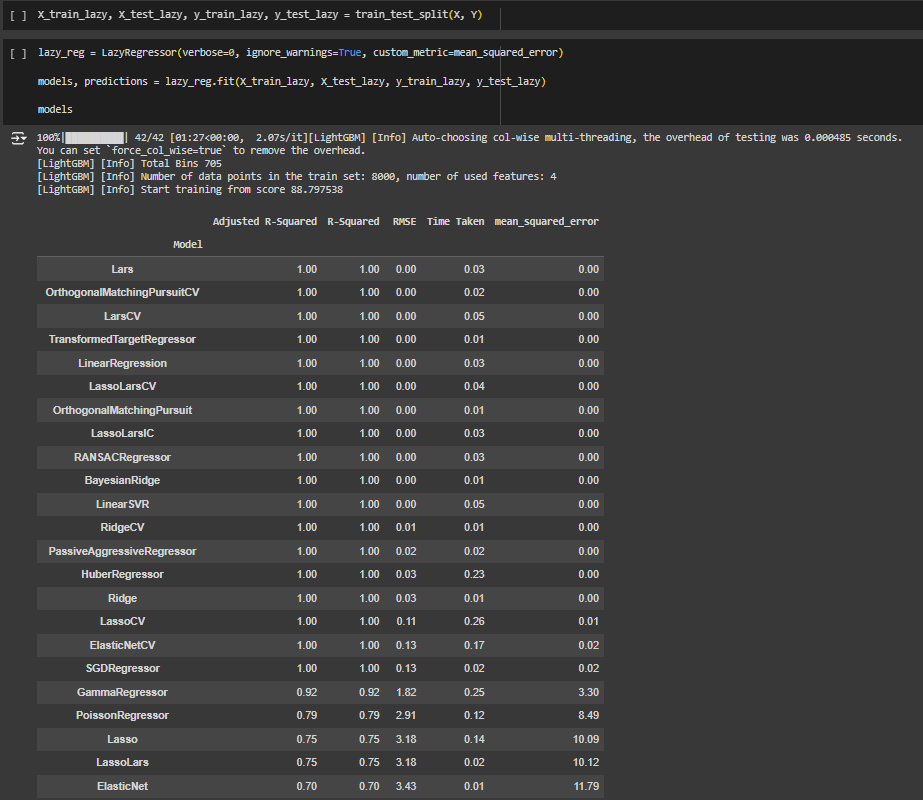
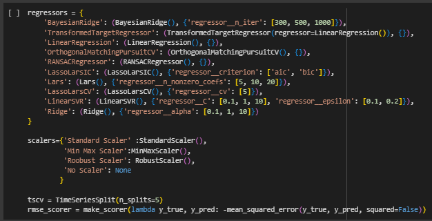
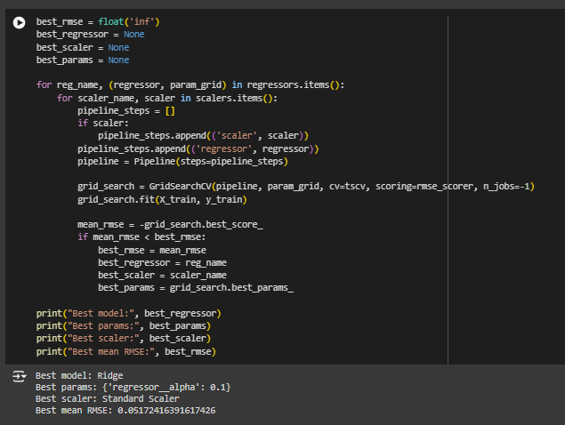
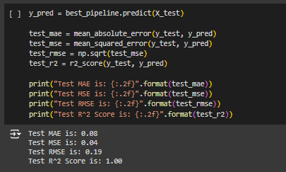
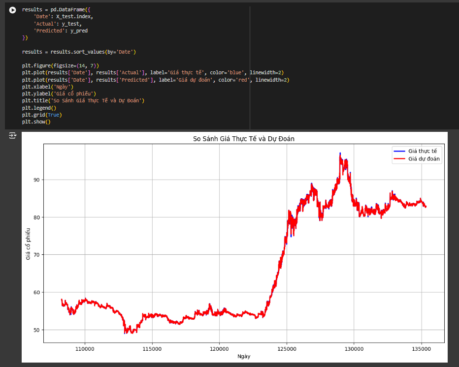
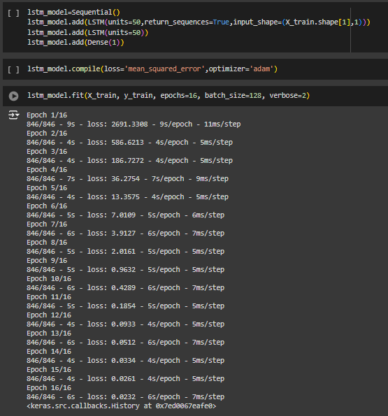
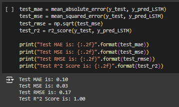
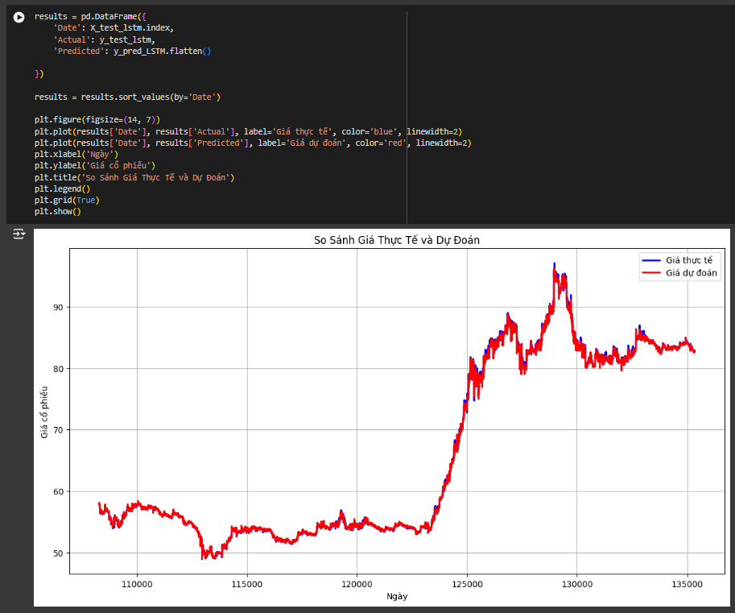

# Summarize notebook
## Use LazyPredict  

## Use Scikit-learn on the best models from LazyPredict  

## Use the best model to calculate MAE/MSE/RMSE/R2  

## Use LSTM  

## Use LSTM model to calculate MAE/MSE/RMSE/R2  

